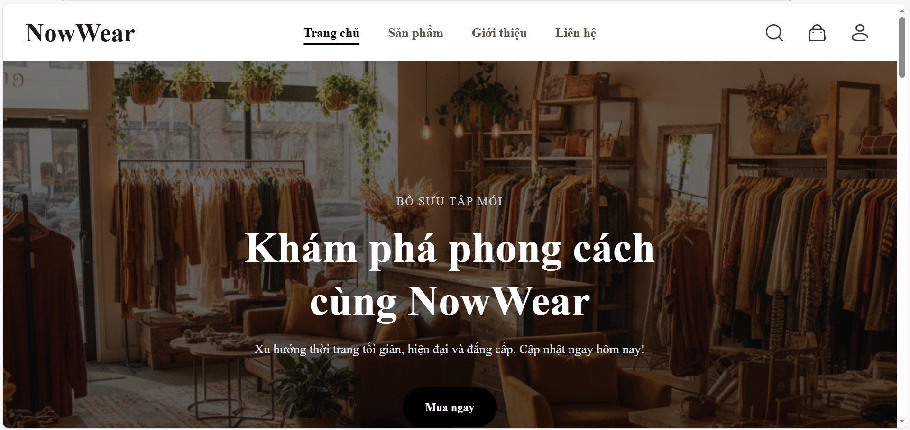
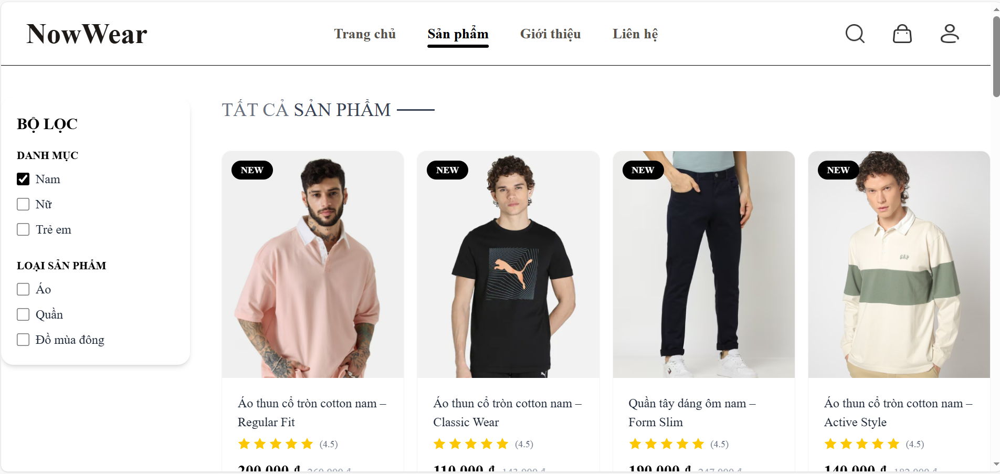
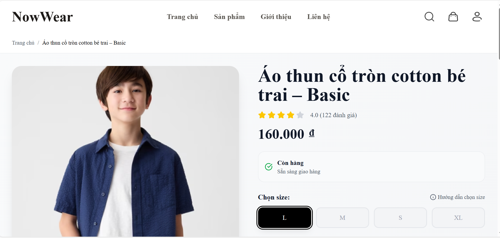
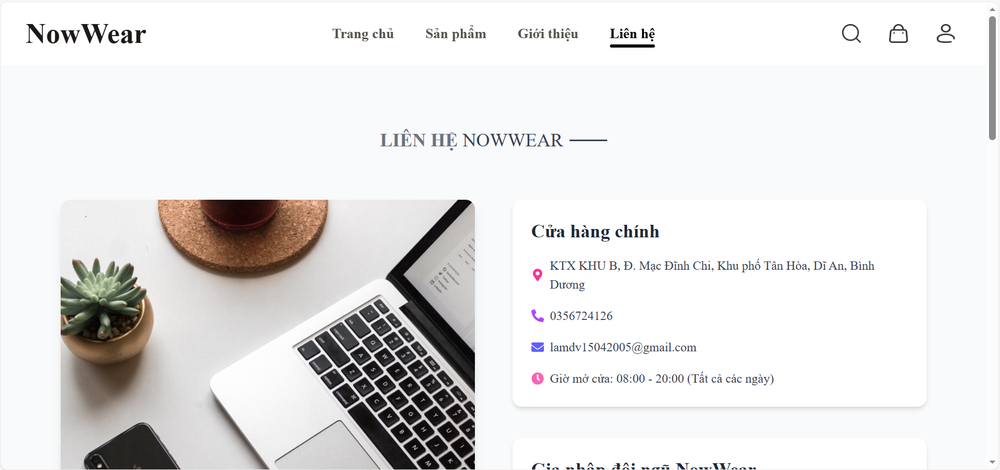

# 🛍️ NowWear Shop – Website Shop Quần Áo

## 📌 Giới thiệu

**NowWear Shop** là đồ án lập trình web xây dựng một website thương mại điện tử bán quần áo, cho phép người dùng xem sản phẩm, tìm kiếm, đặt hàng và quản lý tài khoản. Dự án được phát triển theo mô hình **Frontend – Backend tách biệt**, sử dụng các công nghệ hiện đại.

* **Frontend**: ReactJS
* **Backend**: Java Spring Boot (REST API)
* **Database**: MySQL

---

## 🎯 Mục tiêu của đồ án

* Áp dụng kiến thức lập trình web vào dự án thực tế
* Xây dựng hệ thống bán hàng hoàn chỉnh (CRUD, giỏ hàng, đặt hàng)
* Làm quen với mô hình Client – Server và RESTful API
* Rèn luyện kỹ năng làm việc với ReactJS và Spring Boot

---

## 🧩 Chức năng chính

### 👤 Người dùng (User)

* Đăng ký, đăng nhập, đăng xuất
* Xem danh sách sản phẩm
* Xem chi tiết sản phẩm
* Tìm kiếm và lọc sản phẩm theo danh mục
* Thêm sản phẩm vào giỏ hàng
* Đặt hàng và xem lịch sử đơn hàng

### 🔐 Quản trị viên (Admin)

* Quản lý sản phẩm (thêm / sửa / xóa)
* Quản lý danh mục sản phẩm
* Quản lý người dùng
* Quản lý đơn hàng
* Quản lý doanh thu

## Hình ảnh minh họa 
#### Trang trang chủ


#### Trang sản phẩm


#### Trang chi tiết sản phẩm


#### Trang giới thiệu


#### Trang thông tin liên hệ


## 🛠️ Công nghệ sử dụng

### Frontend

* ReactJS
* React Router DOM
* Axios
* HTML5, CSS3, JavaScript
* Tailwind CSS

### Backend

* Java Spring Boot
* Spring Web (REST API)
* Spring Data JPA
* Spring Security (JWT Authentication – nếu có)
* Hibernate

### Database

* MySQL

---

## 🏗️ Kiến trúc hệ thống

```
ReactJS (Client)
      |
      |  HTTP / JSON
      v
Spring Boot REST API (Server)
      |
      v
   Database (MySQL)
```

## ⚙️ Cài đặt và chạy dự án

### 1️⃣ Backend (Spring Boot)

```bash
# Mở project backend
# Cấu hình database trong application.properties
spring.datasource.url=jdbc:mysql://localhost:3306/nowwear_db
spring.datasource.username=
spring.datasource.password=

# Chạy project
mvn spring-boot:run
```

Backend chạy tại: `http://localhost:8080`

---

### 2️⃣ Frontend (ReactJS)

```bash
# Cài đặt thư viện
npm install

# Chạy project
npm start
```

Frontend chạy tại: `http://localhost:3000`

---

## 🔗 API tiêu biểu

* `GET /api/products` – Lấy danh sách sản phẩm
* `GET /api/products/{id}` – Chi tiết sản phẩm
* `POST /api/auth/login` – Đăng nhập
* `POST /api/orders` – Đặt hàng

---

## 📸 Giao diện (Demo)

* Trang chủ
* Trang danh sách sản phẩm
* Trang chi tiết sản phẩm
* Trang giỏ hàng
* Trang quản trị (Admin)

*

*

---

## 📄 Ghi chú

* Dự án phục vụ mục đích học tập
* Có thể mở rộng thêm: thanh toán online, đánh giá sản phẩm, phân quyền nâng cao

## ❤️ Lời cảm ơn

Xin chân thành cảm ơn giảng viên đã hướng dẫn và tạo điều kiện để nhóm hoàn thành đồ án này.
